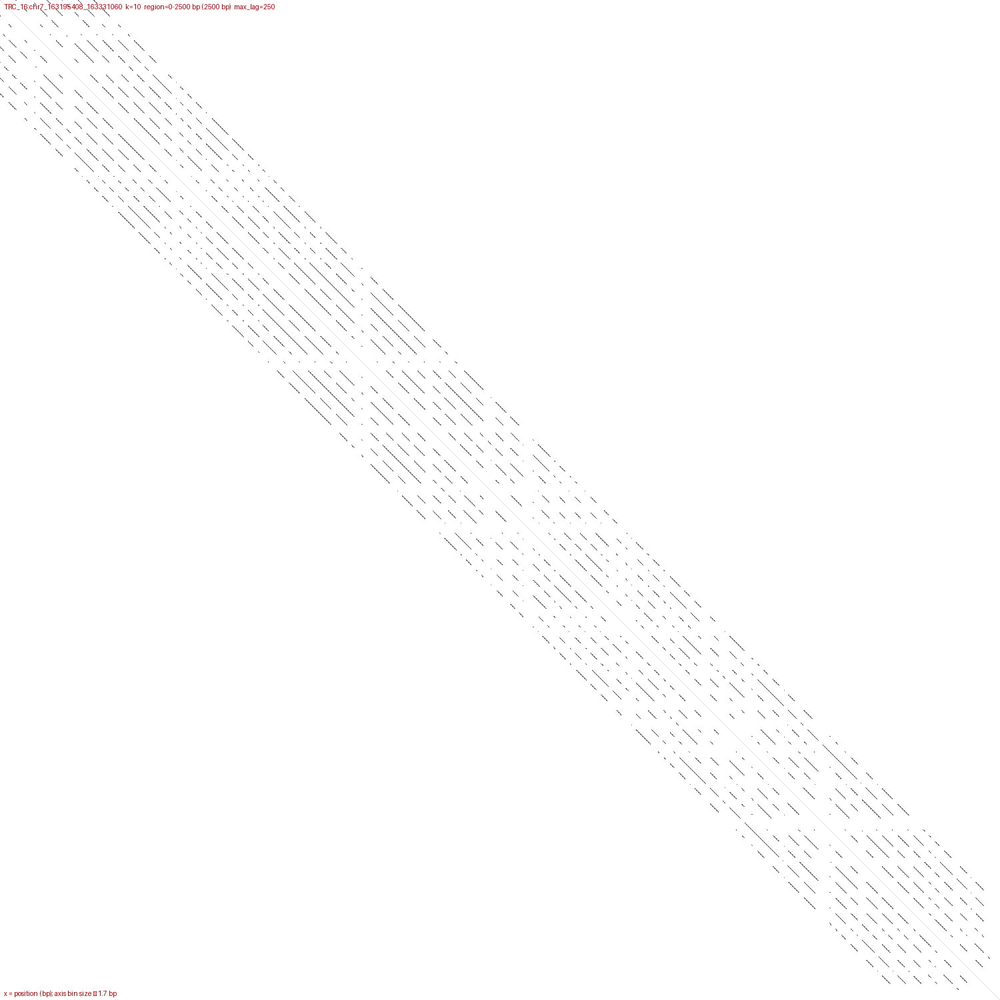
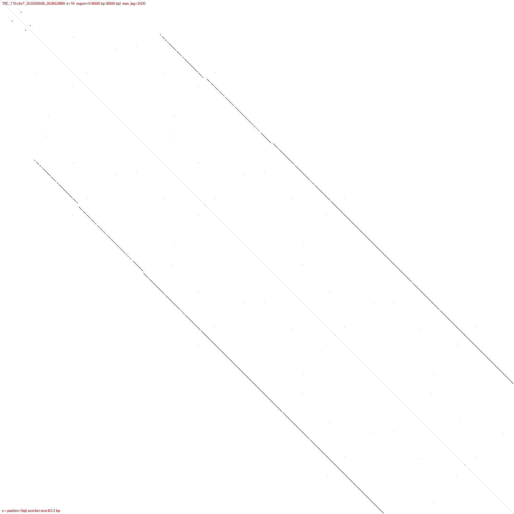
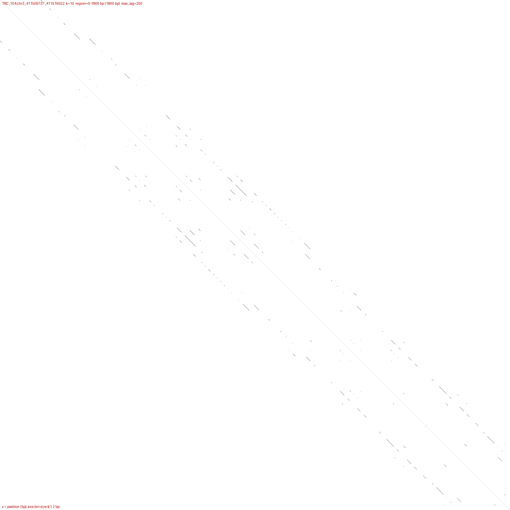
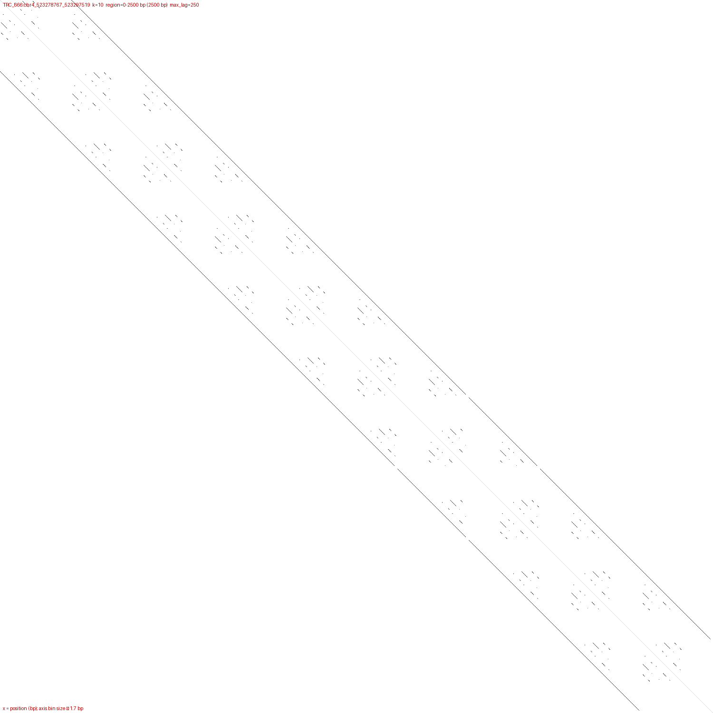

# `kitehor rescore` — pairwise tile-identity rescoring

`rescore` adds a nucleotide-level confidence signal to kite's peaks. For
each candidate period it samples adjacent tile pairs from the array and
computes their median pairwise identity, alignment shift, two derived
flags, and a spatial-coherence statistic for the high-identity hits.
The output is kite's peaks TSV with **15 appended columns**:
`identity_med`, `identity_iqr`, `identity_p25`, `identity_n`,
`shift_med`, `shift_consistency`, `phantom`, `subrepeat`,
`coverage_frac`, `spatial_contrast`, `founder_period`,
`kmer_autocorr_founder`, `kmer_phase_contrast`,
`scan_n_intervals`, `scan_occupancy_frac`.

The metric is **additive only**. Downstream stages (rule-classify,
analyze) still decide on kite's `score2_norm`; rescore is a diagnostic
column that downstream analysis can consult independently.

> **Onboarding**: read [`docs/onboarding_pipelines.md`](onboarding_pipelines.md)
> for a side-by-side view of `rescore` and `report`. This document is
> the per-flag reference.

## Reading a rescore row — quick interpretation

A rescore row carries three independent signals on the same
`(record, period)` candidate:

1. **Pairwise alignment** — `identity_med`, `identity_iqr`,
   `identity_p25`, `coverage_frac`, `spatial_contrast`. Measures
   "what does this period look like under banded edit-distance
   alignment of adjacent tile pairs?"
2. **K-mer-positional structure** — `kmer_autocorr_founder`,
   `kmer_phase_contrast`. Folds the k-mer pair midpoints by the
   founder cycle to ask "is the period-P signal phase-locked to
   the founder?"
3. **Per-base shifted-self-alignment scan** — `scan_n_intervals`,
   `scan_occupancy_frac`. The strictest of the three: a per-base
   match indicator at lag `period`, smoothed and thresholded.
   See [Shifted self-alignment scan](#shifted-self-alignment-scan).

The `phantom` and `subrepeat` booleans summarise the first family
(alignment) plus the founder-gate post-pass. The k-mer and scan
columns are **observational** in v0.12 — they don't flip the
existing booleans, but you can use them to triage borderline rows.

### "Is this row a real nested subrepeat?"

| signal | strong "yes" | strong "no" | notes |
|---|---|---|---|
| `subrepeat` | `true` | `false` | summarises the alignment-based gates |
| `scan_occupancy_frac` (P < founder/4) | > 0.15 | < 0.05 | strictest — no alignment slop |
| `scan_n_intervals` (same) | tens+ | 0 | small number = single localised region |
| `kmer_autocorr_founder` | > 0.4 | < 0 | jitter-tolerant on long arrays |
| `kmer_phase_contrast` | > 0.10 | ≈ 0 | jitter-tolerant on short arrays |
| `founder_period` | known | `NA` | no founder ⇒ the booleans + scan are the only reliable signal |

The four diagnostic columns (autoF + phaseC + scan_n + scan_occ)
**agree on real subrepeats** (TRC_104, TRC_666, TRC_79, TRC_84
showed at least 3 of 4 elevated). When they disagree with
`subrepeat=true`, suspect a rescore over-flag — especially when
`founder_period = NA` (TRC_14-class).

### "Is this a phantom (sub-period harmonic)?"

| signal | "yes" | notes |
|---|---|---|
| `phantom` | `true` | derived from shift_med + shift_consistency |
| `shift_med` | non-zero, with high `shift_consistency` | the kernel slid into a neighbouring tile |
| `scan_occupancy_frac` | typically low | the candidate isn't actually a real period |

### "Is this a clean array-wide periodicity?"

When the row's period is the founder / HOR-unit:

| signal | "yes" | notes |
|---|---|---|
| `identity_med` | ≥ 0.85 | high alignment identity at adjacent tiles |
| `coverage_frac` | ≈ 1.0 | almost all sampled pairs hit |
| `scan_occupancy_frac` | 0.7–1.0 | clean tandem; 0.3–0.7 indicates boundary jitter |
| `subrepeat` | `false` | by construction (period ≥ founder doesn't qualify) |

### Quick decision rule

```
if subrepeat = true AND scan_occupancy_frac > 0.10:
    high-confidence nested subrepeat
elif subrepeat = true AND scan_occupancy_frac ≈ 0:
    rescore likely over-flagged; check founder_period (often NA)
elif subrepeat = false AND scan_occupancy_frac > 0.20 AND period < founder/4:
    real nested subrepeat that the alignment-based gates missed
elif phantom = true:
    sub-period harmonic; not a real period
elif identity_med > 0.85 AND coverage_frac > 0.9:
    real array-wide period (founder / HOR-unit / harmonic)
else:
    noise / weak signal
```

## Status

Stable. Ten feature drops:

1. **Tier 1** — banded DP kernel, `u16` cells, scratch reuse, runtime
   logging, CLI defaults (`--top-n 10`, `--max-period 5000`).
2. **Phantom flag** — `shift_med` / `shift_consistency` derived from
   the kernel's optimal-column-at-row-m output.
3. **Subrepeat flag (Step A)** — heuristic derived from
   `identity_p25 + identity_iqr + identity_med + phantom`.
4. **Step B** — `coverage_frac` column + refined subrepeat using
   `coverage_frac ∈ [0.10, 0.50]`.
5. **Period-relative band** — auto-band scales to `max(20, 2·slop,
   ⌈0.02·P⌉)` so long monomers don't saturate at the band cap.
6. **Founder gate** — `subrepeat` post-pass overrides
   `period ≥ founder_period` rows to `false`; founder is the
   lowest-rank row with `identity_med ≥ 0.70` and `phantom != true`.
   The selected founder period is exposed as the `founder_period`
   column.
7. **Spatial-contrast gate (Step C)** — new `spatial_contrast`
   column distinguishes a real localised motif (high-identity pairs
   clustered in a few array bins) from a near-founder harmonic
   (high-identity pairs scattered uniformly across the array, even
   though the marginal identity distribution looks bimodal).
   `subrepeat` now additionally requires `spatial_contrast ≥
   --subrepeat-spatial-contrast-min` (default 0.40); when
   `spatial_contrast` is `NA`, `subrepeat` is `NA` rather than
   `false`.
8. **Period/founder ratio gate (Step D)** — augments the founder
   gate's post-pass. A real subrepeat must tile multiple times
   inside one founder, so its period must be much shorter than
   the founder. The gate suppresses `subrepeat = true` whenever
   `period > founder_period · --subrepeat-period-founder-max-ratio`
   (default 0.25 — period must be ≤ founder/4, i.e. tile ≥ 4 times).
   Catches the slow-phase-drift near-founder harmonics that
   `spatial_contrast` lets through because the drift cycles cluster
   hits in a few array regions (TRC_115:chr7_353599568 P=1955 inside
   founder P=2018, ratio 0.97). Applied only when the per-record
   founder is known; rows in records with no qualifying founder are
   unaffected.
9. **K-mer-positional diagnostics** — `kmer_autocorr_founder` and
   `kmer_phase_contrast` columns (cols 12, 13). Both fold the
   per-record k-mer pair midpoint list by the founder cycle and
   ask whether the period-P signal is phase-locked to the founder.
   Observational — do not gate the `subrepeat` flag in this
   release. On the IPIP 2026-04-14 corpus, 94 % of 53 currently-
   flagged subrepeats with known founder have at least one of
   `autoF ≥ 0.4` OR `phaseC ≥ 0.10` elevated.
10. **Shifted self-alignment scan (Step E)** — `scan_n_intervals`
    and `scan_occupancy_frac` columns (cols 14, 15). For every
    `(record, period)` row, computes the windowed match rate at
    lag `period` via cumulative-sum convolution, finds contiguous
    runs above `--scan-id-threshold` (default 0.55) of length
    ≥ `(min_copies − 1) · period` indices, and reports
    `n_intervals` + `occupancy_frac`. Observational; the strictest
    per-base discriminator. Validated visually via the regime
    gallery below + 30-record dotplot panel (`tools/subrepeat_scan/
    render_candidates.py`).

93 unit tests + 2 integration tests cover the kernel, sampler,
aggregators, scan, and end-to-end behaviour. The two derived
flags (`phantom`, `subrepeat`) are **mutually exclusive** by
construction (the founder gate / phantom priority enforces it).

## Why rescore exists

Kite scores periodicity by k-mer set overlap in the neighbour-distance
histogram. That signal can fail to separate the **monomer period** from
the **HOR-unit period** in well-formed HORs — the k-mer pool is shared
between the two scales. Pairwise nucleotide identity does separate them:

- At P = monomer, adjacent tiles are *different* monomers within an HOR
  block and look ~80% identical.
- At P = HOR unit (k × monomer), adjacent tiles are consecutive *copies*
  of the same HOR and look ~95–99% identical.

The period with the higher `identity_med` is the more credible HOR unit
length. See `tests/rescore_smoke.rs` for the headline correctness assertion.

## CLI

```
kitehor rescore <FASTA>... --peaks <peaks.tsv> -o <prefix>
```

- `<FASTA>...` — one or more FASTA files containing the records named in
  `peaks.tsv`. Sequences are looked up by `case_id`; records missing from
  the FASTAs produce `NA` rows.
- `--peaks` — long-format peaks TSV emitted by `kitehor kite-periodicity`
  (header must contain `case_id`, `rank`, `period`).
- `-o <prefix>` — output is written to `<prefix>.peaks.tsv`. The stage
  refuses to overwrite any existing file at that path; pass `--force` to
  allow in-place rewriting (e.g. when `-o` resolves to the same file as
  `--peaks`).

### Flags

| flag | default | notes |
|---|---|---|
| `--samples K` | `200` | sampled pairs per (record, period); linear cost |
| `--slop` | `10` | bp of slack on the B-tile to absorb tile-boundary indels; must satisfy `slop ≤ period` |
| `--band` | `0` (auto) | indel-deviation tolerance for the banded kernel; auto = `max(20, 2·slop, ⌈0.02·P⌉)` |
| `--max-n-frac` | `0.05` | skip pairs whose combined N fraction exceeds this |
| `--max-retries` | `3` | extra draws per slot when an initial draw is N-rejected |
| `--min-period` | `20` | skip candidates below this; emit NA for those rows |
| `--max-period` | `5000` | skip candidates above this; `0` = unlimited |
| `--seed` | `42` | top-level RNG seed (deterministic per `(seed, case_id)`) |
| `--top-n` | `10` | only rescore the first N peaks per record; `0` = all |
| `--mismatch-cost` | `1` | per-cell cost of a mismatch (match is always 0) |
| `--gap-cost` | `1` | per-cell cost of an insertion or deletion (no affine gaps; ins == del) |
| `--shift-identity-min` | `0.5` | pairs below this identity are excluded from the shift aggregate |
| `--shift-min-pairs` | `5` | minimum high-identity pairs for `shift_med` to be non-NA |
| `--shift-tol-frac` | `0.05` | `\|shift_med\| / period` threshold for the phantom flag |
| `--shift-consistency-min` | `0.5` | min fraction of high-identity pairs within ±1 bp of `shift_med` |
| `--subrepeat-p75-min` | `0.70` | minimum identity_p75 for the subrepeat flag |
| `--subrepeat-iqr-min` | `0.15` | minimum identity_iqr (bimodal-spread gate) |
| `--subrepeat-med-max` | `0.70` | maximum identity_med (separates from real periods) |
| `--coverage-threshold` | `0.70` | per-pair identity that counts as a hit for `coverage_frac` |
| `--subrepeat-cov-min` | `0.10` | minimum `coverage_frac` for the subrepeat flag |
| `--subrepeat-cov-max` | `0.50` | maximum `coverage_frac` for the subrepeat flag |
| `--subrepeat-founder-id-min` | `0.70` | min identity_med for a row to qualify as the per-record founder against which subrepeat candidates are gated |
| `--subrepeat-spatial-contrast-min` | `0.40` | min `spatial_contrast` for the subrepeat flag; below this the candidate's hits are too uniformly scattered (near-founder harmonic) and the flag is suppressed |
| `--subrepeat-period-founder-max-ratio` | `0.25` | max `period / founder_period` for the subrepeat flag; a real subrepeat tiles ≥ 4 times inside the founder. Rows with `period > founder · max_ratio` have `subrepeat` overridden to `false` (applied only when founder is known) |
| `--min-array-bp` / `--max-n-fraction` | shared QC | inherits from `QcOpts` |
| `--threads` | `0` (auto) | rayon worker count |

### Scoring caveat

The defaults `--mismatch-cost 1 --gap-cost 1` give plain Levenshtein
edit distance, so `identity_med = 1 − edit_distance/|A|` is exactly the
matching fraction. With non-unit costs the returned value is a *weighted*
edit distance: `identity_med` stays in `[0, 1]` and ranks pairs the same
way, but no longer equals matches/|A|. Useful when you want to bias the
DP toward (or against) gaps — e.g. `--mismatch-cost 3 --gap-cost 1`
encourages gap-based alignments through divergent stretches.

### Runtime logging

With `-v` (info level), `rescore` emits three structured lines per run:

```
rescore: loaded 1600 record(s), 14466 peak row(s); 11842 to rescore (filters: min_period=20, max_period=5000, top_n=10)
rescore: K=200 slop=10 band=20 max_retries=3 seed=42 threads=16
rescore: 4231/11842 (35.7%) elapsed=120s rate=35/s eta=218s         ← every 10s
rescore: done in 187.4s — rescored 11815, filtered 2624, kernel-NA 27, identity_n median=200
```

`filtered` = rows blocked before the kernel by rank/period/missing-record;
`kernel-NA` = rows passed the filters but the kernel returned no usable
identity (short array or N-rejected all samples).

## Algorithm

For each (record, candidate period P):

1. Sample `K` anchor offsets uniformly from `[0, L − 2P − slop]` using a
   ChaCha20 PRNG seeded with FNV-1a of `(seed, case_id)`.
2. For each anchor `s`, form two windows:
   - **A** = `seq[s .. s + P]` (length P)
   - **B** = `seq[s + P − slop .. s + 2P + slop]` (length P + 2·slop)
3. Drop pairs whose combined N fraction exceeds `max_n_frac` and re-draw
   up to `max_retries` times.
4. Compute the **semi-global edit distance** of A against the best window
   inside B (A consumed end-to-end; B has free ends). Identity =
   `1 − edit_distance / P`.
5. Report `identity_med`, `identity_iqr`, `identity_p25` over the K
   identities, plus `identity_n` (effective sample count after rejection).

Sampling is **adjacent-tile only** (`d=1`). Multi-distance probing
(`d=2,3,…` for drift assessment) is a future flag, not v1.

### Edge cases

- Period below `min_period`, or `slop > period`, or `L < 2P + slop` ⇒ all
  four columns are `NA`, `identity_n = 0`.
- Record not found in any FASTA, or failed QC at load time ⇒ `NA` row.
- All sampled pairs N-rejected ⇒ `NA` row.

### N handling

The kernel treats `N` as matching nothing (including another `N`). The
sampler's skip-pair logic keeps the kernel from seeing N-heavy windows in
practice; the conservative match rule is just a safety net for the few Ns
that slip through.

## Output schema

`<prefix>.peaks.tsv` is the input file with **fifteen columns appended**:

```
identity_med  identity_iqr  identity_p25  identity_n  shift_med  shift_consistency  phantom  subrepeat  coverage_frac  spatial_contrast  founder_period  kmer_autocorr_founder  kmer_phase_contrast  scan_n_intervals  scan_occupancy_frac
```

- `identity_med`, `identity_iqr`, `identity_p25` — `%.4f` ∈ [0, 1].
- `identity_n` — effective sample count after N-rejection.
- `shift_med` — median alignment shift (bp) over high-identity pairs;
  positive means the best alignment landed downstream of the natural
  mapping. `NA` when fewer than `--shift-min-pairs` pairs cleared
  `--shift-identity-min`.
- `shift_consistency` — fraction of high-identity pairs with shift
  within ±1 bp of `shift_med`. `NA` whenever `shift_med` is `NA`.
- `phantom` — `true` / `false` / `NA`. See "Phantom periods" below.
- `subrepeat` — `true` / `false` / `NA`. See "Subrepeat flag" below. Always
  `false` (never `true`) on rows where `phantom = true`.
- `coverage_frac` — `%.4f` ∈ [0, 1]. Fraction of pairs whose identity
  reached `--coverage-threshold`. Independent diagnostic of "how much of
  the array this period actually tiles". Real periods sit near 1.0,
  noise near 0, subrepeats in the middle band.
- `spatial_contrast` — `%.4f` ∈ [0, 1] / `NA`. Difference between the
  highest and lowest per-bin hit fractions when sampled pairs are
  binned by anchor offset into 10 equal bins. **Discriminates a real
  localised subrepeat (high contrast, hits clustered) from a
  near-founder harmonic (low contrast, hits scattered uniformly).**
  `NA` when fewer than 2 bins meet the per-bin minimum (very short
  arrays). See "Subrepeat flag" below.
- `founder_period` — int / `NA`. The per-record founder period (bp)
  used by the founder gate — the lowest-rank row with `identity_med
  ≥ --subrepeat-founder-id-min` and `phantom != true`. Same value
  across every row of a record. `NA` when no row in the record met
  the founder criteria.
- `kmer_autocorr_founder` — `%.4f` / `NA`. **Observational** — does
  not gate the `subrepeat` flag. Pearson autocorrelation of the
  period-`period` k-mer pair density profile at lag =
  `founder_period`. High (≈ +0.6 to +1.0) when density(x)
  oscillates with the founder period — strong evidence of a real
  nested subrepeat. Vulnerable to boundary jitter; on real
  centromeric arrays ~75 % of currently-flagged subrepeats clear
  the 0.4 threshold. `NA` when founder unknown, total matching
  pairs < `min_total_pairs`, or autocorrelation variance is zero.
  See [the metric guide](#interpreting-kmer_autocorr_founder--kmer_phase_contrast)
  below.
- `kmer_phase_contrast` — `%.4f` ∈ [0, 0.5] / `NA`.
  **Observational** — does not gate the `subrepeat` flag. Bins
  midpoints by `(mid mod founder_period)` into 12 phase bins,
  finds the contiguous half (6 bins) holding the most midpoints,
  returns `(max_half_fraction − 0.5)`. High (≈ 0.30–0.50) when
  midpoints prefer one half of the founder cycle — TRC_104-style
  evidence (subrepeat occupies one contiguous portion of each
  founder copy). Jitter-tolerant on short arrays; smears toward
  zero on very long arrays. `NA` when founder unknown.
- `scan_n_intervals` — int / `NA`. **Observational** — does not
  gate the `subrepeat` flag. Number of contiguous tandem-positive
  runs found at this row's period by the shifted-self-alignment
  scan (see [Shifted self-alignment scan](#shifted-self-alignment-scan)
  below). `0` means the scan ran but found no qualifying run.
  `NA` means the scan did not run (disabled via `--no-scan` or
  array too short).
- `scan_occupancy_frac` — `%.4f` ∈ [0, 1] / `NA`.
  **Observational** — does not gate the `subrepeat` flag.
  Fraction of the array occupied by tandem-positive runs at this
  row's period — `occupied_bp / array_length`. High at long
  periods (the founder / HOR-unit scale) confirms array-wide
  tandem structure; intermediate at short periods (subrepeat
  scale) is evidence of a real nested tandem.
- All original cells are passed through **verbatim** (no float
  reformatting), so byte-equality is preserved on the unchanged columns.

## Shifted self-alignment scan

For every kite-reported `(record, period)` row, `rescore` computes
a per-base shifted match indicator
`match[i] = 1 if seq[i] == seq[i+period] else 0`, smooths it via a
period-wide forward window (the mean over `match[i..i+period]`),
and reports contiguous runs above an identity threshold. A run of
window-indices of length `r` corresponds to a sequence interval of
length `r + period` bp.

**CLI knobs:**

| flag | default | meaning |
|---|---|---|
| `--scan-id-threshold` | `0.55` | min per-window match rate to qualify a window; lower admits more divergent tandems, higher rejects noise |
| `--scan-min-copies` | `3` | minimum tandem copies; min qualifying run length is `(min_copies − 1) · period` indices |
| `--no-scan` | (enabled) | disable; both scan columns emit `NA` for every row |

**Interpretation by period regime:**

- **Short period (≈ kite-reported subrepeat scale, ~20–60 bp):**
  - `scan_occupancy_frac` 0.05–0.20: nested subrepeat exists in
    some founder copies only (TRC_104-class pattern).
  - 0.20–0.60: nested subrepeat in most founders (TRC_666-class).
  - ≥ 0.60: strongly recurring at this period — confirm it isn't
    a sub-multiple of the founder.
  - 0.00 with `scan_n_intervals = 0`: no contiguous tandem run
    met the threshold; strong evidence against a real nested
    subrepeat at this period.
- **Long period (≈ founder / HOR-unit scale):**
  - High `scan_occupancy_frac` (~0.9–1.0): clean tandem at this
    period — the candidate IS a real array-wide periodicity.
  - Moderate `scan_occupancy_frac` (0.3–0.7): array is tandem at
    this period but has substantial boundary jitter / indels
    breaking the per-base match. **Important caveat:** the scan
    has no alignment slop, so even ±1 bp of drift between
    founder copies locally drops the per-window rate below
    threshold. Real centromeric tandems with indel drift will
    show this pattern.
  - Low `scan_occupancy_frac` (~0): candidate period is not
    actually a periodicity of the array at the strict per-base
    level — corroborates that this is a near-founder / harmonic
    artifact.

**Calibration on IPIP 2026-04-14** (3024 records, 21,685 rescored,
default thresholds):

| | count | % of rescored |
|---|---:|---:|
| `scan_occupancy_frac > 0.05` | 5,883 | 27.1 % |
| `scan_occupancy_frac > 0.15` | 4,868 | 22.4 % |
| `scan_occupancy_frac > 0.50` | 2,474 | 11.4 % |
| `scan_occupancy_frac > 0.95` | 413 | 1.9 % |

Per-record wall-time impact: ~5 s on top of the existing
~165 s rescore time on IPIP (`O(L)` per row, cumulative-sum
trick).

**Canonical IPIP spot-checks:**

| record | period | scan_n_intervals | scan_occupancy_frac | what it means |
|---|---|---|---|---|
| TRC_104:chr3_411509737 | 36 (subrepeat) | 50 | 0.44 | real nested subrepeat — many short tandem runs along the array |
| TRC_104 | 180 (founder) | 2 | 0.08 | array-wide tandem with substantial boundary drift |
| TRC_115:chr7_353599568 | 1955 (FP) | 0 | 0.00 | not a real period — scan confirms |
| TRC_115 | 2018 (founder) | 8 | 0.63 | tandem with moderate jitter |
| TRC_666:chr4_523278767 | 36 (subrepeat) | 150 | 0.46 | real high-divergence nested subrepeat |
| TRC_666 | 250 (founder) | 2 | 0.99 | clean array-wide tandem |
| TRC_14:chr1_315645785 | 163 | 0 | 0.00 | rescore `subrepeat=true` but no real tandem at this period — likely false positive |

### Regime gallery — visual anchors for the interpretation table

The four PNGs below are self-self k-mer dotplots generated by
[`tools/subrepeat_scan/dotplot.py`](../tools/subrepeat_scan/dotplot.py)
(NumPy + Pillow; no matplotlib dep). For each pixel `(i, j)`, a dot
is plotted whenever `seq[i:i+k] == seq[j:j+k]` (`k=10`); the canvas
is binned so the axis bin size is shown in the figure footer.
`--max-lag` is set per case to make the relevant scale visible
without losing the picture to longer-range structure.

#### Regime 1 — clean tandem at short P (TRC_16:chr7_163195408)

`scan_occupancy_frac ≈ 1.00` at P=39 (founder = period). Thick band
of parallel diagonals at lag = 39 bp uniformly across the region; no
founder-scale blob structure because the whole array IS the 39-bp
tandem.



#### Regime 2 — jittered tandem at long P (TRC_115:chr7_353599568)

`scan_occupancy_frac ≈ 0.63` at P=2018 (founder). Clean long-range
diagonals at lag ≈ 2018 bp, **no** short-lag structure. The
fractional occupancy (vs the ideal 1.0) is the per-base
shifted-match measure of boundary jitter / indels between founder
copies — the diagonals are visible but broken.



#### Regime 3 — real nested subrepeat (TRC_104:chr3_411509737)

`scan_occupancy_frac ≈ 0.44` at P=36 (subrepeat inside founder=180).
Clustered short-lag diagonals at lag ≈ 36 bp, organised into blobs
along the diagonal at the founder-scale spacing (~180 bp).
**Gaps** between blobs are visible — that's the founder's
non-subrepeat region, which produces no period-36 match. Each blob
= the subrepeat region of one founder copy.



#### Regime 4 — high-divergence nested subrepeat (TRC_666:chr4_523278767)

`scan_occupancy_frac ≈ 0.46` at P=36 (subrepeat inside founder=250).
Same structural signature as TRC_104 (clustered short-lag diagonals
at founder-scale spacing) but **noisier** — individual diagonals are
fainter and more broken because per-copy divergence is higher.
Required `--scan-id-threshold 0.55` to detect; would be missed at
the stricter 0.65.



### Generating your own dotplots

```bash
python3 tools/subrepeat_scan/dotplot.py \
    --fasta <fasta> \
    --record <record_id> \
    --out <out.png> \
    --k 10 \
    --start 0 --end 2500 \
    --max-lag 250
```

Knobs:

- `--start` / `--end`: zoom to a sub-region; default 0..L.
- `--k`: k-mer size; 10–12 is a sensible default for centromeric
  arrays.
- `--max-lag`: cap the longest dot lag (`j − i`) drawn. Lower this
  to focus on subrepeat-scale structure without the founder
  diagonals dominating; raise it to see the founder-scale picture.
- `--canvas`: output canvas size in pixels (square; default 1500).

## Interpreting `kmer_autocorr_founder` + `kmer_phase_contrast`

The two metrics ask the same question — "is the candidate period
living in a specific phase of the founder cycle?" — but in
complementary ways, and they fail in opposite regimes. Use them
together to triage `subrepeat=true` rows.

| pattern | autoF | phaseC | interpretation |
|---|---|---|---|
| both elevated (autoF ≥ 0.4 AND phaseC ≥ 0.10) | high | high | strong nested-subrepeat evidence |
| autoF elevated, phaseC low | high | low | likely real subrepeat in a long array where phase drift smeared phaseC |
| autoF low, phaseC elevated | low | high | likely real subrepeat in a short array where autoF can't lock the autocorrelation (TRC_104 pattern) |
| both low | low | low | weak k-mer-positional evidence; the existing gates already drove the decision |
| both elevated on a non-subrepeat row | high | high | near-founder coincidence pattern; check `period / founder_period` ratio |

On the IPIP 2026-04-14 corpus, 94 % of 53 currently-flagged
subrepeats with known founder have at least one of `autoF ≥ 0.4`
OR `phaseC ≥ 0.10` elevated; only 6 % light up neither. The two
metrics are genuinely complementary — each catches a class the
other misses.

## Phantom periods

A "phantom" period is a candidate that scores high on `identity_med`
purely because the kernel's slop window lets the alignment slide into
the *real* adjacent tile, even though the claimed period is wrong.

Example from `TRC_755_chr1_426382304_426397308` (IPIP 2026-04-14):

| rank | period | identity_med | shift_med | shift_consistency | phantom |
|---|---|---|---|---|---|
| 1 | 62 | 0.871 | 0 | 0.69 | false |
| 2 | 124 | 0.807 | -1 | 0.59 | false |
| 4 | **56** | **0.875** | **+6** | **0.67** | **true** |

The array's real periodicity is 62 bp. Kite picks up a low-strength
echo at P=56; rescore *would* report identity 0.875 for it, but the
alignment systematically lands 6 bp downstream of the natural mapping
(`+6 / 56 = 10.7 % > tol_frac = 5 %`, concentration `0.67 > 0.5`).
The phantom flag fires, and downstream consumers know to treat P=56
as a sub-tile artifact rather than a genuine periodicity.

The mechanism only catches shifts smaller than `slop`. A claim of P=20
when the real period is 200 manifests as low identity, not a phantom
flag — the kernel can't slide that far.

Calibration on the 1600-case `ground_truth_v2` corpus with defaults:

| | |
|---|---|
| True HOR-unit rows flagged | 0 / 1313 (0.00 %) |
| True monomer rows flagged | 8 / 1576 (0.51 %) |
| Total flagged | 97 / 11387 (0.85 %) |

Zero false positives on the headline target (HOR-unit periods).

## Subrepeat flag

A "subrepeat" peak is a candidate period that is a short tandem motif
localized inside the founder monomer rather than tiling the whole array.
On a dotplot it looks like small squares clustered within the founder
diagonal. Kite captures these as low-strength peaks because the motif
*is* locally tandem; rescore catches them because the per-pair identity
distribution is **bimodal** — some anchors land in the subrepeat region
and score near 1.0, the rest land outside and score near random.

### Mechanism

A bimodal distribution produces a wide IQR with a high `identity_p75`,
a moderate `identity_med`, and a `coverage_frac` between the noise floor
and the real-period ceiling. But **bimodality alone is not enough** —
near-founder harmonics (candidate period within a few bp of the real
founder) also look bimodal because cumulative phase drift causes some
sampled pairs to land in register and others to land off. The
discriminator is **spatial coherence**:

| Source of bimodality | `coverage_frac` shape | spatial pattern |
|---|---|---|
| Real localised subrepeat | intermediate (10–50 %) | hits cluster in a few array bins → **high `spatial_contrast`** |
| Near-founder harmonic | intermediate (10–50 %) | hits scattered uniformly across bins → **low `spatial_contrast`** |

So the subrepeat gate is:

```
subrepeat = identity_p75       ≥ subrepeat_p75_min                  (default 0.70)
        AND identity_iqr       ≥ subrepeat_iqr_min                  (default 0.15)
        AND identity_med       <  subrepeat_med_max                 (default 0.70)
        AND coverage_frac      ≥  subrepeat_cov_min                 (default 0.10)
        AND coverage_frac      ≤  subrepeat_cov_max                 (default 0.50)
        AND spatial_contrast   ≥  subrepeat_spatial_contrast_min    (default 0.40)
        AND phantom            != true
        AND period             ≤  founder_period · max_ratio        (default 0.25)
```

The **period / founder_period ratio gate** (last line) is the
biological "tiles ≥ 4 times inside the founder" constraint. It
catches near-founder harmonics where the slow phase drift
accidentally clusters hits in a few array regions and beats the
spatial-contrast test (e.g. P = 1955 inside founder P = 2018 has
ratio 0.97 and clusters hits in the array region where the drift
happens to land in-phase — both bimodality and spatial-contrast
pass, only the ratio gate rules it out).

`spatial_contrast` is computed by binning the anchor offsets of all
sampled pairs into `SPATIAL_N_BINS = 10` equal bins, computing each
bin's hit fraction (pairs with identity ≥ `--coverage-threshold`
divided by total pairs in the bin), and reporting
`max_bin_hit_fraction − min_bin_hit_fraction` over bins with
≥ `SPATIAL_MIN_PAIRS_PER_BIN = 5` samples. When fewer than 2 bins
meet that minimum (very short arrays, or default `--samples 200`
with extreme rejection), `spatial_contrast` is `NA` and the
subrepeat gate cannot fire — `subrepeat` is reported as `NA`, not
`false`, so downstream code distinguishes "no data" from
"explicitly rejected".

The **founder gate** is enforced as a post-pass: per record, the
"founder" is the lowest-rank row with `identity_med ≥
subrepeat_founder_id_min` (default 0.70) and `phantom != true`. The
selected founder period is exposed in the `founder_period` column
so the gate is auditable without re-running rescore. Any candidate
whose `period > founder · --subrepeat-period-founder-max-ratio`
(default 0.25) has `subrepeat` overridden to `false`. Two distinct
classes of false positive collapse into one rule with this
formulation:

1. **Long-period harmonics** (`period ≫ founder`): the bimodality
   heuristic occasionally fires on multiples of the founder; the
   ratio gate suppresses them trivially.
2. **Near-founder harmonics** (`period ≈ founder`): slow phase
   drift between candidate and founder periods clusters hits in a
   few array regions, so the bimodality + `spatial_contrast` tests
   both pass; only the ratio constraint identifies these as
   non-subrepeats.

When no row meets the founder identity criteria, `founder_period`
is `NA` and the gate cannot apply — the row's `subrepeat` value
comes from the upstream bimodality + spatial tests alone.

Real periods (high `identity_med`, narrow IQR, coverage near 1) and
noise periods (low `identity_p75`, low coverage) both fail at least one
gate. Phantom-flagged rows are excluded so the two boolean columns are
mutually exclusive on true cases.

### Detection floor

Each of the two width-related gates (`identity_p75` ≥ 0.70 *and*
`coverage_frac` ≥ 0.10) caps the practical floor:

- `identity_p75` ≥ 0.70 implicitly requires the top 25 % of sampled
  pairs to score high, but only because IQR semantics demand a fixed
  quartile. With **K = 200 the floor is `coverage_frac` ≈ 0.10
  (≈ 20 hits)**.
- For a smaller footprint (< 5 %), raise `--samples` to keep the
  expected hit count above the noise.

### IPIP 2026-04-14 — flag rates by gate addition

Cumulative effect on the 3024-record / 52,510-peak IPIP corpus
(21,685 rescored after rank / period filters):

| build | `subrepeat=true` | Δ vs v0.11 | gate added |
|---|---:|---:|---|
| v0.11 (pre-Step C) | 909 (4.2 %) | — | bimodal + coverage + founder-strict gate |
| v0.12 + Step C only | 703 (3.2 %) | −23 % | + `spatial_contrast ≥ 0.40` |
| v0.12 + Step C + D | **319 (1.5 %)** | **−65 %** | + `period ≤ founder · 0.25` |

Of the 319 surviving in v0.12: 53 have a known founder (all with
`period / founder ∈ (0, 0.25]` by construction, distributed evenly
across the band — no threshold cliff), 266 are in records where no
peak qualified as founder (the ratio gate cannot apply). Phantom
rate unchanged across all builds (≈ 1.5 %).

### Example (IPIP 2026-04-14)

```
case_id                              rank  period  id_med  id_p75  id_iqr  phantom  subrepeat
TRC_318_chr6_541268834_541295618      1     34     0.97    0.97    0.35    false    false   (real period — id_med passes med_max gate)
TRC_104_chr3_411443670_411481970      2     36     0.60    0.72    0.17    false    true    (bimodal + moderate median ⇒ subrepeat)
TRC_170_chr7_137243949_137267671      6     20     0.60    0.75    0.20    false    true
```

## Performance

The kernel is banded semi-global DP at `O(P · band)` per pair (~50-100×
faster than plain DP on long-period candidates). Cost scales linearly in
`K`, in candidate period `P`, and in `band`. The default `max-period=5000`
cap and `top-n=10` together keep the long-period tail bounded.

The auto-band formula `max(20, 2·slop, ⌈0.02·P⌉)` widens the band on
long monomers so DP saturation doesn't artificially crush identity in
satellites with realistic internal indel rates (≈ 1 %). Cost scales
linearly with the band, so long-period peaks cost ~3× more than under
a fixed `band = 20`.

Indicative wall times (1600-case `ground_truth_v2/` corpus, K=200, defaults,
16 cores):

| stage | time |
|---|---|
| `kite-periodicity` (input) | ~35 s |
| `rescore` (banded DP, auto-band) | ~70 s |

On the IPIP 2026-04-14 corpus (3024 records, 305 MB, K=200, defaults):
~17 s kite + ~180 s rescore. The `O(P · band)` cost dominates on the
long-period tail; for cases where the user knows they don't need
wide-band recovery, passing `--band 20` halves the rescore time.

## Calibration

Run against the 1600-case `ground_truth_v2/` corpus with default flags
(K=200, slop=10, band=20 auto, max_period=5000, top_n=10):

| Category | n | HOR-unit wins | mono identity | HOR identity | gap |
|---|---|---|---|---|---|
| hor_clean | 600 | 100.0% | 0.828 | 0.971 | +14.2 pp |
| hor_event_* (4 cats) | 200 | 100.0% | 0.821 | 0.961 | +13.9 pp |
| hor_insertion | 100 | 100.0% | 0.836 | 0.960 | +12.4 pp |
| hor_shift | 200 | 100.0% | 0.838 | 0.960 | +12.2 pp |
| hor_wobble | 100 | 100.0% | 0.839 | 0.960 | +12.1 pp |
| mixed | 100 | 67.0% | 0.676 | 0.779 | +10.4 pp |
| **TOTAL** | **1300** | **97.5%** | **0.819** | **0.951** | **+13.2 pp** |

A "win" means `identity_med` at the true HOR-unit period exceeded
`identity_med` at the true monomer period (lookup tolerance ±5% on
period). Period matches existed for every case; no NA rows in any
category.

The 33% loss rate on `mixed` reflects the underlying structural ambiguity
of interleaved HOR cases — when two distinct HORs share the array, a
period at one HOR's monomer can score higher local identity than the
other HOR's unit period. Banded edit distance correctly exposes this
ambiguity; the prior un-banded kernel masked it with over-permissive
substring matching.

## Worked example (smoke fixture)

```
$ kitehor kite-periodicity test_data/smoke/sequences.fasta -o /tmp/k.tsv
$ kitehor rescore test_data/smoke/sequences.fasta \
      --peaks /tmp/k.tsv.peaks.tsv -o /tmp/r --top-n 5

# case_id    rank period identity_med
hor_k3       1    300    0.9033   ← HOR unit
hor_k3       2    100    0.7400   ← monomer
hor_k5       1    750    0.9033   ← HOR unit
hor_k5       2    150    0.7633   ← monomer
tandem_pure  1    60     1.0000
```

kite's `score2_norm` correctly ranks the HOR-unit period first in both
HOR fixtures, but the identity gap to the monomer (0.90 vs ~0.75) is the
diagnostic signal a downstream stage can use to disambiguate "real HOR"
from "monomer-only tandem repeat that happens to expose harmonics in the
periodogram".
